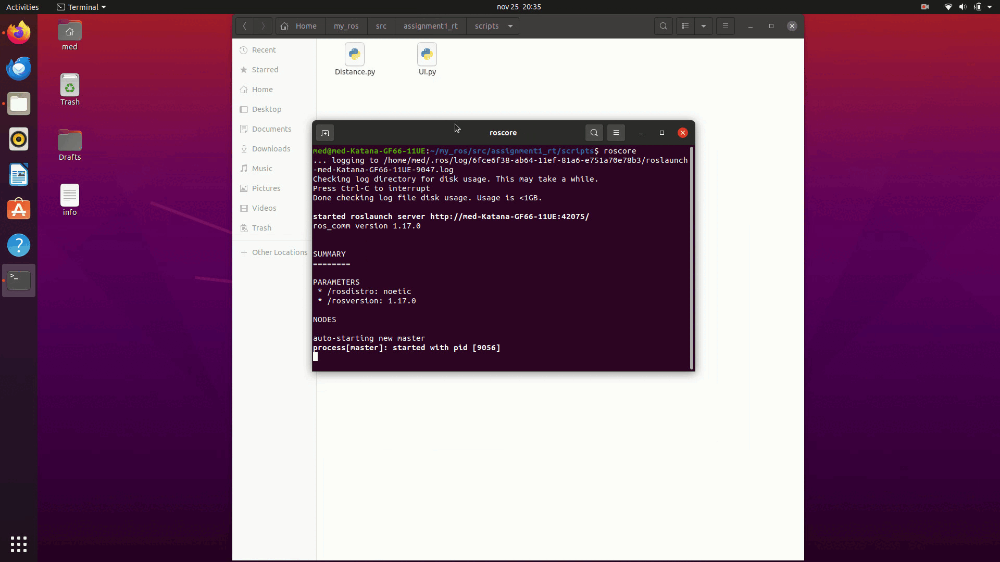

# Assignment1_rt: Turtle Simulation Project

## Overview:

This repository named `assignment1_rt` implements two ROS nodes for controlling two turtles velocities, the distance between them and from borders in a simulated environment using the `turtlesim` package.

### Features:
1. **UI Node**:
   - Allows the user to control two turtles (`turtle1` and `turtle2`) via a simple command-line interface.
   - The user can input linear and angular velocities for the selected turtle.
   - The command is applied for 1 second, after which the turtle stops moving.
   - The user can input new commands to control the turtles again.

2. **Distance Node**:
   - Monitors the relative distance between `turtle1` and `turtle2`.
   - Publishes the distance between the turtles to a topic (`/turtle_distance`).
   - Stops a turtle if it gets too close to the other turtle (based on a threshold of 2.0 meters).
   - Stops a turtle if it moves too close to the boundaries of the environment (i.e., the position exceeds a limit of `x` or `y > 10.0` or `x` or `y < 1.0).

## Prerequisites:
- ROS installed (Noetic).
- turtlesim package installed.

## Setup : 
- we Used the previous workspace `my_ros`. 
- we created a new package using `catkin_create_pkg assignment std_msgs roscpp rospy`.
- we created two nodes in the `src` directory named `UI` and `Distance` using cpp and modify the `CMakeLists.txt` file accordingly, doing the same using python in the `scripts` directory.

## File structure:

├─assignment1_rt/ <br>
├── CMakeLists.txt <br>
├── package.xml <br>
├── src/ <br>
├    ├── ui.cpp <br>
├    └── distance.cpp <br>
└── scripts/ <br>
     ├── ui.py <br>
     └── distance.py <br>
     
### Key Components:  
      
## 1. **UI Node**
- **ROS Publisher**:
  - `ros::Publisher pub`: Publishes `geometry_msgs::Twist` messages to control the velocity of a selected turtle (`turtle1` or `turtle2`).

- **getUserInput Function**:
  - Collects user input for selecting which turtle to control (`turtle1` or `turtle2`), and the desired linear and angular velocities.
  
- **Main Logic**:
  - Initializes the ROS node and service client.
  - Spawns a second turtle (`turtle2`) at the given position (x=2, y=1) on the screen using the `turtlesim/Spawn` service.
  - The `getUserInput` function collects user input for the robot name and desired velocities.
  - The user is prompted for velocity inputs in a loop, allowing control of the selected turtle (`turtle1` or `turtle2`) by publishing the velocities as `geometry_msgs::Twist` messages.
  - If the user selects `turtle1`, the control command is published to `/turtle1/cmd_vel`, and similarly for `turtle2`published to `/turtle2/cmd_vel`.
  - The system allows control of both turtles simultaneously, sending velocity commands for 1-second intervals.
  - After each command, the turtle's motion is halted by setting both linear and angular velocities to zero.
  
## 2. **Distance Node**
- **ROS Publisher**:
  - `ros::Publisher cmd_vel_pub_1`, `cmd_vel_pub_2`: Publish stop commands to the turtles (`turtle1` and `turtle2`) when needed.
  - `ros::Publisher distance_pub`: Publishes the distance between the two turtles.

- **ROS Subscriber**:
  - Subscribes to the `/turtle1/pose` and `/turtle2/pose` topics to receive the position (`turtlesim::Pose`) of each turtle.

- **Main Logic**:
  - The system continuously monitors the positions of both turtles and calculates the distance between them.
  - If the distance between the turtles becomes smaller than a threshold (`DISTANCE_THRESHOLD`), it stops the respective turtle by publishing a zero velocity (`geometry_msgs::Twist` with linear and angular velocities set to zero).
  - It also monitors whether the turtles are close to the boundary and stops them if necessary.
  - The Euclidean distance is calculated using the formula:
                   distance=sqrt((x_1−x_2)^2+(y_1−y_2)^2)
               
  - The distance is published on the `/turtle_distance` topic for monitoring.
  - The `calculateDistance_PublishAndCheck` function calculates the distance between `turtle1` and `turtle2` and checks if it falls below the threshold or if the turtles are too close to the boundary. If so, it stops the respective turtle.
  - The system runs in a loop, continuously subscribing to the position topics and checking the conditions.

## Example of running both nodes:
1. **Lunch** `turtlesim`**:** <br>
Before running the two nodes we need to start roscore: 
```bash
roscore
```
we open another terminal and run the `turtlesim` node : 
```bash
rosrun turtlesim turtlesim_node
```
2. **Run the UI Node:**
- In cpp : <br>
```bash
rosrun assignment1_rt UI_node
```
- In python : <br>
```bash
rosrun assignment1_rt UI.py
```
3. **Run the Distance Node:**
- In cpp : <br>
```bash
rosrun assignment1_rt Distance_node
```
- In python : <br>
```bash
rosrun assignment1_rt Distance.py
``` 



